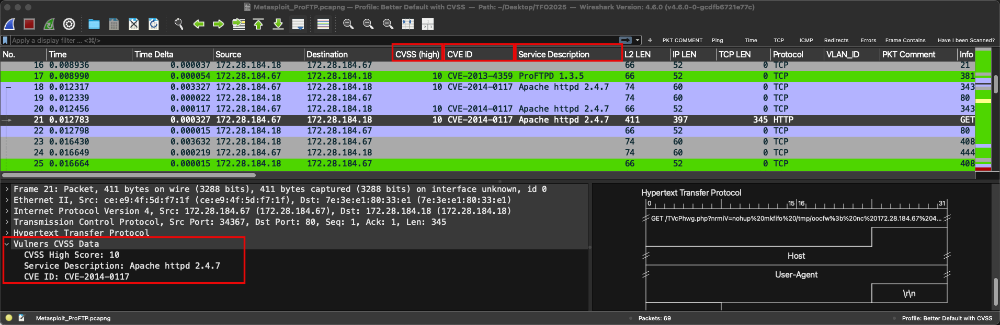

# Wireshark Vulnerability Correlator

[]()
[]()
[]()
[]()

A powerful Wireshark plugin that bridges the gap between vulnerability scanning and network traffic analysis. This plugin correlates nmap Vulners XML vulnerability scan results with captured network traffic, providing **real-time vulnerability context** directly in the Wireshark interface.


## 🎯 **What It Does**

Transform your network analysis workflow by automatically identifying vulnerable services in your packet captures:

- 🔍 **Real-time Detection**: Instantly spot vulnerable services in network traffic
- 📊 **CVSS Integration**: View vulnerability severity scores directly in packet columns
- 🏷️ **CVE Tracking**: Display CVE identifiers for immediate vulnerability research
- 🖥️ **Service Context**: Show detailed service information (e.g., "Apache httpd 2.4.7", "OpenSSH 6.6.1p1")
- 🎨 **Visual Highlighting**: Automatic color-coding of high-risk packets
- 📈 **Comprehensive Reports**: Generate detailed vulnerability correlation reports
- 🔎 **Advanced Filtering**: Use Wireshark's powerful display filters with vulnerability data

## 🚀 **Key Features**

### **Vulnerability Column Integration**
- **CVSS Score**: Numeric field supporting comparisons (`vulners.cvss_high >= 7.0`)
- **CVE ID**: String field for tracking specific vulnerabilities (`vulners.cve_id == "CVE-2018-1312"`)
- **Service Description**: Service identification from nmap scan (`vulners.service_desc contains "Apache"`)



### **Smart Traffic Correlation**
- Automatically matches scan results with network traffic
- Protocol-aware vulnerability association (TCP/UDP)
- Direction-aware analysis (client → server vs server → client)

### **Professional Reporting**
- Scan summary with vulnerability statistics
- Traffic correlation analysis
- Detailed findings with packet locations
- Severity breakdowns and risk assessments


## 📋 **Quick Start**

### Prerequisites
- **Wireshark** (version 4.0+) - [Download here](https://www.wireshark.org/download.html)
- **nmap** with Vulners script
- **Network capture files** (pcap/pcapng)
- **Vulnerability scan results** (XML format from nmap Vulners)

## 🧪 **Sample Files & Demo**

**Try it immediately with included sample data!** We've provided test files so you can see the plugin in action right away.

### **Quick Demo Setup**
```bash
# 1. Clone the repository
git clone https://github.com/netwho/wireshark-vulnerability-correlator.git
cd wireshark-vulnerability-correlator

# 2. Use the sample files in the samples/ directory:
# - Metasploit_ProFTP.pcapng - Real network capture with vulnerable ProFTP traffic  
# - vulners_scan.xml - Nmap vulnerability scan results with CVE data

# 3. Configure plugin to use sample data
nano ~/.local/lib/wireshark/plugins/vulners_correlator_final.lua
# Update: prefs.xml_path = "/path/to/samples/vulners_scan.xml"
```

### **What You'll See**
- 🔴 **High-severity vulnerabilities** (CVSS ≥ 7.0) highlighted in red
- 🎯 **CVE identifiers** displayed directly in packet columns  
- 🖥️ **Service details** showing "ProFTPD 1.3.5" with vulnerability context
- 📊 **Real correlation** between network traffic and vulnerability scan data

### **Sample Analysis Results**
The demo shows ProFTP service communication correlated with **CVE-2015-3306** (CVSS: 9.8), demonstrating how the plugin identifies vulnerable services in real network traffic.

**📖 For detailed sample usage instructions and advanced examples:** [samples/README.md](./samples/README.md)

## 🖥️ **Installation**

We provide **automated installers for all major platforms** to make installation as easy as possible:

### **🍎 macOS (Automated)**
```bash
# 1. Download/clone this repository
git clone https://github.com/netwho/wireshark-vulnerability-correlator.git

# 2. Navigate to the Mac installer
cd wireshark-vulnerability-correlator/Mac-Installer/

# 3. Run the automated installer
./install_vulners_plugin.sh
```

### **🐧 Linux (Automated)**
```bash
# 1. Download/clone this repository
git clone https://github.com/netwho/wireshark-vulnerability-correlator.git

# 2. Navigate to the Linux installer
cd wireshark-vulnerability-correlator/Linux-Installer/

# 3. Make installer executable and run
chmod +x install_vulners_plugin_linux.sh
./install_vulners_plugin_linux.sh
```

**Supported Linux Distributions:**
- Ubuntu 18.04+ / Debian 9+
- Fedora 30+ / CentOS 7+ / RHEL 7+
- Arch Linux / openSUSE Leap 15.0+
- Most other modern Linux distributions

### **🪟 Windows (Automated)**
```powershell
# 1. Download/clone this repository
git clone https://github.com/netwho/wireshark-vulnerability-correlator.git
cd wireshark-vulnerability-correlator\Windows-Installer\

# 2. Run the PowerShell installer
.\install_vulners_plugin_windows.ps1

# Or right-click the .ps1 file and select "Run with PowerShell"
```

**Windows Requirements:**
- Windows 10+ (recommended) or Windows 8.1 with PowerShell 5.0+
- Wireshark 3.0 or later

## ✨ **What All Installers Do**

All our automated installers provide the same comprehensive setup:

- ✅ **Prerequisites Check**: Verify Wireshark and required tools are installed
- ✅ **Smart Detection**: Auto-detect platform and provide specific guidance
- ✅ **Plugin Installation**: Copy plugin to correct directory with proper permissions
- ✅ **Profile Creation**: Create "Vulnerability Analysis" Wireshark profile
- ✅ **Column Configuration**: Pre-configure CVSS Score, CVE ID, and Service Description columns
- ✅ **Color Filters**: Set up automatic highlighting for vulnerability severity levels
- ✅ **Recent Filters**: Add useful display filters to filter history
- ✅ **Verification**: Confirm installation and provide troubleshooting guidance
- ✅ **Safety**: Backup existing files and provide detailed instructions

## 📚 **Platform-Specific Guides**

For detailed platform-specific instructions, troubleshooting, and advanced options:

- **📖 macOS**: [Mac-Installer/README.md](./Mac-Installer/README.md)
- **📖 Linux**: [Linux-Installer/README.md](./Linux-Installer/README.md)  
- **📖 Windows**: [Windows-Installer/README.md](./Windows-Installer/README.md)

## ⚙️ **Manual Installation (All Platforms)**

If you prefer manual installation or our automated installers don't work for your setup:

### **1. Install Plugin File**
```bash
# macOS/Linux
mkdir -p ~/.local/lib/wireshark/plugins
cp vulners_correlator_final.lua ~/.local/lib/wireshark/plugins/
chmod 644 ~/.local/lib/wireshark/plugins/vulners_correlator_final.lua
```

```powershell
# Windows (PowerShell)
New-Item -Path "$env:APPDATA\Wireshark\plugins" -ItemType Directory -Force
Copy-Item "vulners_correlator_final.lua" "$env:APPDATA\Wireshark\plugins\"
```

### **2. Configure Wireshark Profile**
1. Launch Wireshark
2. Go to **Edit → Configuration Profiles**
3. Create a new profile: **"Vulnerability Analysis"**
4. Add these columns to the packet list:
   - **CVSS Score**: `%Cus:vulners.cvss_high:0:R`
   - **CVE ID**: `%Cus:vulners.cve_id:0:R`
   - **Service Description**: `%Cus:vulners.service_desc:0:R`
5. Set up color filters for vulnerability highlighting (see platform guides)

## 📡 **Usage Workflow**

### 1. **Generate Vulnerability Scan**
Scan your target network with nmap and Vulners:
```bash
# Basic scan with vulnerability detection
nmap -sV --script vuln,vulners -oX vulners_scan.xml 192.168.1.0/24

# Enhanced scan with Shodan API (recommended)
nmap -sV --script vuln,vulners --script-args vulners.shodan-api-key=YOUR_KEY \
     -oX vulners_scan.xml 192.168.1.0/24
```

### 2. **Configure Plugin**
Update the XML file path in the plugin:

```bash
# macOS/Linux
nano ~/.local/lib/wireshark/plugins/vulners_correlator_final.lua

# Update line 5 with your scan file location:
prefs.xml_path = "/path/to/your/vulners_scan.xml"
```

```powershell
# Windows - Edit with Notepad
notepad "$env:APPDATA\Wireshark\plugins\vulners_correlator_final.lua"

# Update line 5 (use double backslashes in Windows paths):
prefs.xml_path = "C:\\path\\to\\your\\vulners_scan.xml"
```

### 3. **Analyze Traffic**
1. Launch Wireshark with the "Vulnerability Analysis" profile
2. Load your packet capture file
3. Vulnerability data populates automatically in columns
4. Use the **Tools → Vulnerability Correlator** menu for advanced features

### 4. **Generate Reports**
Access comprehensive analysis via **Tools → Vulnerability Correlator**:
- **Load XML Data**: Parse vulnerability scan results
- **Generate Report**: Create detailed correlation reports
- **Instructions**: View setup and usage help

## 🔍 **Display Filter Examples**

The plugin adds powerful filtering capabilities to Wireshark:

### **CVSS-based Filtering**
```bash
# Show all vulnerable traffic
vulners.cvss_high > 0

# High severity vulnerabilities (≥7.0)
vulners.cvss_high >= 7.0

# Critical vulnerabilities only (≥9.0)
vulners.cvss_high >= 9.0

# Medium severity range
vulners.cvss_high >= 4.0 and vulners.cvss_high < 7.0
```

### **CVE-specific Filtering**
```bash
# Show packets with CVE identifiers
vulners.cve_id

# Specific CVE
vulners.cve_id == "CVE-2018-1312"

# CVEs from specific year
vulners.cve_id contains "CVE-2018"

# Multiple years with regex
vulners.cve_id matches "CVE-201[5-8]"
```

### **Service-based Filtering**
```bash
# Apache services
vulners.service_desc contains "Apache"

# SSH services
vulners.service_desc contains "SSH"

# ProFTPD services
vulners.service_desc contains "ProFTPD"
```

### **Combined Advanced Filters**
```bash
# High-risk HTTP traffic
vulners.cvss_high >= 7.0 and tcp.port == 80

# SSH vulnerabilities with packets
vulners.service_desc contains "SSH" and vulners.cvss_high > 0

# Critical CVEs in captured traffic
vulners.cve_id and vulners.cvss_high >= 9.0
```

## 🎨 **Visual Analysis**

### **Automatic Color Coding**
The plugin applies intelligent color filters:
- 🔴 **Red Background**: High severity (CVSS ≥ 7.0) - Immediate attention required
- 🟡 **Yellow Background**: Medium severity (CVSS 4.0-6.9) - Monitor closely  
- 🟢 **Green Background**: Low severity (CVSS > 0-3.9) - Informational

### **Column Layout**
Optimized packet list with vulnerability context:
```
No. | Time | Source | Destination | CVSS Score | CVE ID | Service Description | Protocol | Info
```

## 📊 **Sample Report Output**

```
═══════════════════════════════════════════════════════════════════
                 VULNERABILITY CORRELATION REPORT
═══════════════════════════════════════════════════════════════════

📊 SCAN SUMMARY
────────────────────────────────────────────────────────────────
• Scan Time: 2024-10-10 15:30:45
• Nmap Version: 7.94
• Total Hosts Scanned: 25
• Total Hosts Vulnerable: 8
• Total Vulnerable Services: 12
• Total Vulnerabilities Found: 47
• Critical (CVSS ≥9.0): 3 | High (CVSS ≥7.0): 12

📈 CORRELATION SUMMARY  
────────────────────────────────────────────────────────────────
• Packets Processed: 15,482
• Vulnerable Hosts Found in Traffic: 6 of 8 (75.0%)
• Vulnerable Services with Traffic: 9
• Total Vulnerabilities in Captured Traffic: 31

🔍 DETAILED FINDINGS
────────────────────────────────────────────────────────────────
📍 192.168.1.100
  🔴 tcp/21 - ProFTPD 1.3.5 (CVSS: 9.8) CVE-2015-3306
      Packets: 45, 67, 89, 123, 156, 201, 245, 289, 334, 378...
  
  🟡 tcp/22 - OpenSSH 6.6.1p1 (CVSS: 5.3) CVE-2016-20012  
      Packets: 12, 34, 56, 78, 90, 112...
```

## 🛠️ **Technical Details**

### **Supported Protocols**
- TCP and UDP traffic analysis
- IPv4 address correlation
- Port-based service matching

### **Field Reference**
| Field | Type | Description | Filter Example |
|-------|------|-------------|----------------|
| `vulners.cvss_high` | Float | CVSS score (0.0-10.0) | `vulners.cvss_high >= 7.0` |
| `vulners.cve_id` | String | CVE identifier | `vulners.cve_id contains "2018"` |
| `vulners.service_desc` | String | Service description | `vulners.service_desc contains "Apache"` |

### **Plugin Architecture**
- **Language**: Lua (Wireshark native)
- **XML Parser**: Custom SLAXML implementation
- **Performance**: Optimized for large capture files
- **Memory**: Efficient caching for real-time analysis

## 🔧 **Configuration**

### **Plugin Settings**
Edit the plugin file to customize:
- XML file path location
- Debug logging levels
- Column display preferences

### **Profile Customization**  
The "Vulnerability Analysis" profile includes:
- Pre-configured vulnerability columns
- Color filters for severity levels
- Useful display filters in recent history
- Optimized layout for security analysis

## 📁 **File Locations Reference**

### **macOS**
- Plugin: `~/.local/lib/wireshark/plugins/vulners_correlator_final.lua`
- Profiles: `~/.config/wireshark/profiles/Vulnerability Analysis/`

### **Linux**  
- Plugin: `~/.local/lib/wireshark/plugins/vulners_correlator_final.lua`
- Profiles: `~/.config/wireshark/profiles/Vulnerability Analysis/`

### **Windows**
- Plugin: `%APPDATA%\Wireshark\plugins\vulners_correlator_final.lua`
- Profiles: `%APPDATA%\Wireshark\profiles\Vulnerability Analysis\`

## 🚨 **Troubleshooting**

### **Plugin Not Loading**
- Verify plugin file location and permissions
- Check **Help → About → Plugins** in Wireshark
- Ensure file is named exactly: `vulners_correlator_final.lua`
- Restart Wireshark completely

### **No Vulnerability Data**
- Confirm XML file path in plugin configuration
- Verify XML contains nmap Vulners script output
- Check Wireshark console for error messages
- Test XML file accessibility and format

### **Display Filters Not Working**
- Use correct field names (see Field Reference above)
- Remember: CVSS uses numeric comparisons, CVE/Service use string operations
- Test basic filter first: `vulners.cvss_high > 0`
- Ensure you're using the "Vulnerability Analysis" profile

### **Platform-Specific Issues**

#### **macOS**
- Plugin directory: `~/.local/lib/wireshark/plugins/`
- Check file permissions: `chmod 644 vulners_correlator_final.lua`

#### **Linux**
- Add user to wireshark group: `sudo usermod -a -G wireshark $USER`
- Check distribution-specific Wireshark installation
- Verify network capture permissions

#### **Windows**
- Check PowerShell execution policy: `Get-ExecutionPolicy`
- Temporarily disable antivirus if files are blocked
- Use double backslashes in XML file paths: `C:\\path\\to\\file.xml`

## 🤝 **Contributing**

We welcome contributions! Areas for enhancement:
- Additional vulnerability data source support
- Enhanced reporting formats
- Performance optimizations
- Cross-platform installer improvements

## 📄 **License**

This project is licensed under the MIT License - see the [LICENSE](LICENSE) file for details.

## 👤 **Author**

**Walter Hofstetter**  
📧 walter.hofstetter@netwho.com

## ⭐ **Support This Project**

If you find this plugin useful for your security analysis work:
- ⭐ Star this repository
- 🐛 Report bugs and suggest features via Issues
- 📖 Improve documentation
- 🔄 Share with the security community

---

## 🎯 **Real-World Applications**

- **Incident Response**: Quickly identify compromised systems in traffic captures
- **Vulnerability Assessment**: Validate scan results against actual network activity  
- **Threat Hunting**: Hunt for exploitation attempts on known vulnerable services
- **Compliance Reporting**: Document vulnerable service exposure with traffic evidence
- **Red Team Exercises**: Analyze attack paths and vulnerable service exploitation

**Transform your network security analysis with real-time vulnerability intelligence!** 🛡️🔍

---

*Built for cybersecurity professionals who need actionable vulnerability intelligence in their network analysis workflow.*
